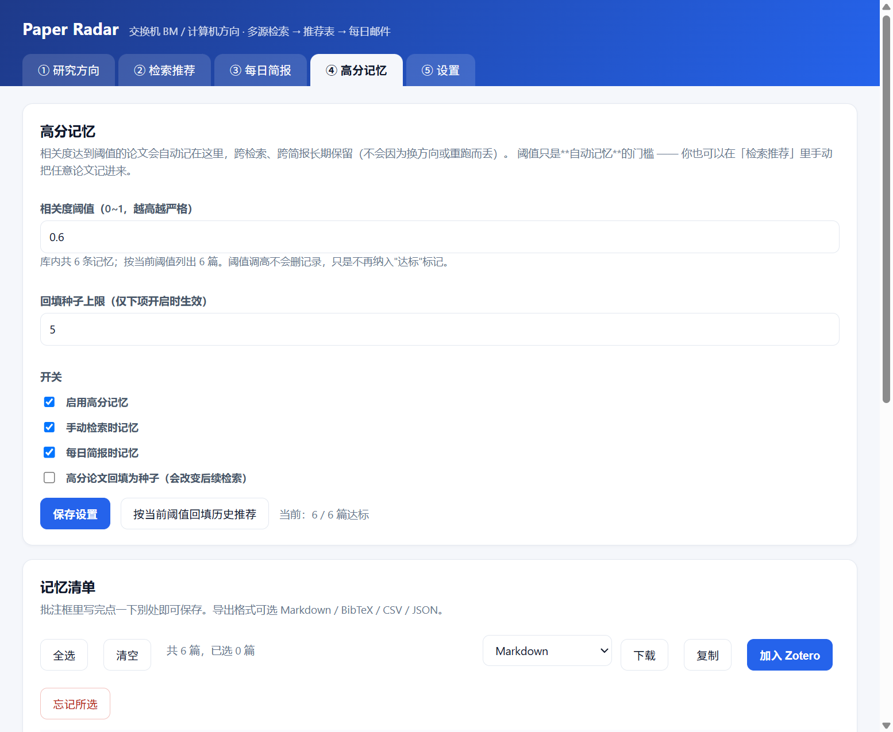

# Paper Radar · 文献检索推荐与每日简报

> 给计算机方向研究者用的"研究雷达"：**用可视 UI 描述你的方向 → 多源自动检索 → 生成带理由的推荐表 → 一键进 Zotero → 每天定时把最新论文写成人话发到你邮箱。**

English: A self-hosted literature radar for CS researchers — describe your research direction in a web UI (free text and/or a few seed papers), let it query Google Scholar / arXiv / OpenAlex / Crossref in parallel, rank and deduplicate the results, write Chinese "summary / highlights / why-it-matters" cards with an LLM, push the ones you pick into Zotero, and mail you a daily digest of new papers on a schedule.

---

## 它能做什么

| 需求 | 实现 |
|---|---|
| ① 可视化改变检索方向 | `http://127.0.0.1:8848` 控制台：写一段方向概要，**或者**丢几篇论文（标题 / DOI / arXiv ID / 链接），点一下自动生成关键词与多条检索式，并且可以手改 |
| ② 多源检索 + 推荐表 | Google Scholar、arXiv、OpenAlex、Crossref（+ 可选 dblp、Semantic Scholar）并发检索 → 去重 → 加权排序 → 表格里给出**内容概要 / 文章特色 / 发表在哪里 / 推荐理由 / 相关度**，勾选后一键写入 Zotero（自动查重、归入指定分类、打标签） |
| ③ 每日定时邮件 | 在 UI 里设定"每天几点 + 星期几 + 每次几篇"，到点自动检索最近的新论文、写概要、发邮件，同时在本机留一份 HTML 报告 |
| ④ 高分记忆 | 相关度达到阈值的论文**自动长期记住**（跨检索、跨简报保留），可查看、写批注、导出 Markdown / BibTeX / CSV / JSON、批量入 Zotero；邮件里给达标论文打 ★ |

设计上刻意做到 **可扩展、少硬编码**：

- **数据源是插件**：`paper_radar/sources/` 下丢一个 `.py` 就自动注册，配置文件决定启不启用；
- **LLM 厂商是配置**：DeepSeek / OpenAI / Moonshot / 智谱 / 本地 Ollama 都在 `config.json` 里，凡是 OpenAI 兼容接口加一行配置就能用；
- **邮件通道是插件**：默认 SMTP，另有 `file` 通道把邮件落成 `.eml` 方便离线预览；
- **导出格式是注册表**：Markdown / BibTeX / CSV / JSON，加一种只需在 `render.EXPORTERS` 注册一项；
- **提示词、分区表、权重、停用词全在配置里**：想换 CCF 分区表、想改推荐口味，改 JSON 即可，不用碰代码；
- 核心运行时**零第三方依赖**（只用 Python 标准库），换台机器 clone 下来就能跑。

---

## 快速开始

```bash
git clone https://github.com/blueroaring/paper-radar.git
cd paper-radar
cp config.example.json config.json      # Windows: copy config.example.json config.json
python -m paper_radar serve             # 打开 http://127.0.0.1:8848
```

要求：**Python 3.10+**，无需 `pip install`（真的不用装东西）。

首次使用建议顺序：

1. 打开控制台 → **⑤ 设置**：填 LLM（provider / base_url / model / api_key）、Zotero（api_key）、邮件（SMTP + 授权码）；
2. **① 研究方向**：写方向概要 + 贴几篇种子论文 → 点「生成检索方案（AI）」→ 检查/修改关键词与检索式；
3. **② 检索推荐**：点「开始检索」→ 看推荐表 → 勾选 → 选 Zotero 分类 → 「加入 Zotero」；
4. **③ 每日简报**：设定时间 → 点「立即试跑（只存报告不发信）」确认效果 → 再点「立即试跑并发送邮件」。

### 命令行也能用

```bash
python -m paper_radar topic add --name "交换机缓冲管理" --direction "共享缓存动态阈值与抢占式缓冲" --seed "10.1145/3689031.3717495"
python -m paper_radar build 1              # 生成关键词与检索式
python -m paper_radar search --topic 1     # 命令行检索，打印推荐表
python -m paper_radar digest --topic 1     # 立即跑一次简报（默认不发信，加 --send 发信）
python -m paper_radar sources --test       # 数据源连通性体检
python -m paper_radar selftest --mail      # LLM / Zotero / 邮件自检（可真的发一封测试信）
python -m paper_radar daemon               # 只跑定时器，不开网页
```

### 桌面快捷方式（一键打开网页）

Windows 上可以建一个桌面图标：双击就打开控制台，**服务没在跑会自动拉起来**（无窗口后台进程），然后打开默认浏览器。

```powershell
powershell -ExecutionPolicy Bypass -File scripts\install_shortcut.ps1
powershell -ExecutionPolicy Bypass -File scripts\install_shortcut.ps1 -Remove   # 删掉
```

- 启动逻辑在 `scripts/open-console.ps1`：从 `config.json` 读端口 → 探测 `/api/state` 确认是**本服务**（不只是"端口有人监听"）→ 必要时用 `pythonw` 无窗口启动 → 轮询到真正可用 → 打开浏览器。失败时弹中文提示框说明怎么办。
- 图标由 `scripts/make_icon.py` 生成（`paper_radar/web/favicon.ico`，16/32/48/256 四种尺寸，纯标准库，不需要 Pillow）。
- 停止服务：`powershell -File scripts\open-console.ps1 -Stop`（只停监听该端口的 Python 进程，不动别的程序）。
- 想在本地排查"浏览器到底请求到没有"：把 `app.access_log` 设为 `true`，请求会写进 `data/access.log`（超过 2 MB 自动截半）。

> 这几个 `.ps1` / `.bat` 一律写成**纯 ASCII**：Windows PowerShell 5.1 会按 ANSI/GBK 解码无 BOM 的脚本，中文注释会让整个脚本解析失败。

---

## 配置与密钥安全

配置是**三层叠加**，后层覆盖前层：

```
config.example.json   （仓库内置默认值，唯一业务参数来源）
   ← config.json      （你的本地配置，已 .gitignore）
   ← secrets.json / 环境变量 PAPER_RADAR_*
```

- **密钥永远不进仓库**：`config.json`、`secrets.json`、`.env` 都在 `.gitignore` 里；控制台保存设置时，密钥单独写进 `secrets.json`（权限 0600），`config.json` 里只有非敏感项。API 回显时会脱敏成 `***`。
- 想用环境变量注入（适合计划任务 / 容器）：

  ```bash
  PAPER_RADAR_LLM_API_KEY=sk-xxx
  PAPER_RADAR_SMTP_PASSWORD=授权码
  PAPER_RADAR_ZOTERO_API_KEY=xxx
  PAPER_RADAR_LLM__MODEL=deepseek-chat      # 双下划线表示层级：llm.model
  ```

- Zotero 的 key 也可以沿用文件方式：`zotero.api_key_file` 默认 `~/.dsh/zotero-key`，或直接填在设置里。
- **user_id 免填**：只给 key，程序会用 `GET /keys/<key>` 自动解析出 userID。

常用配置项速查：

| 键 | 作用 |
|---|---|
| `sources.enabled` | 启用哪些数据源 |
| `sources.per_source_limit` | 每个源、每条检索式取多少条 |
| `sources.http.min_interval` | 按域名的限速（Google Scholar 建议 ≥5 秒） |
| `search.weights` | 相关度 / 时效 / 引用 / 发表处 四项权重 |
| `search.venue_tiers` | 发表处分区表（默认一套 CS 会议期刊清单，可整表换成 CCF） |
| `search.year_lookback` | 默认回溯年数 |
| `llm.providers` | LLM 厂商表；`llm.provider` 选当前使用的 |
| `prompts.*` | 三个提示词模板（方向画像 / 推荐卡片 / 相关性打分） |
| `profile.stopwords` | 追加停用词，让自动关键词更准 |
| `digest.time` / `days` / `top_n` | 每日简报的时间、星期、篇数 |
| `mail.transport` | `smtp`（真发）或 `file`（落成 .eml 预览） |

---

## 数据源可用性（实测，不是纸面推断）

| 数据源 | 是否需要 key | 提供什么 | 备注 |
|---|---|---|---|
| **OpenAlex** | 否 | 发表处、年份、引用数、作者、摘要 | 最稳，兜底主力 |
| **Google Scholar** | 否（页面解析） | 全量程覆盖、引用数 | 必须低频（默认 5s/次），触发人机校验会跳过本数据源 |
| **Crossref** | 否 | 权威发表处、DOI、作者 | 稳定，补 venue 与 DOI |
| **arXiv** | 否 | 预印本、完整摘要、最新 | 官方 API 在部分网络下会 **429 / 超时**，此时自动降级到分类 RSS（`rss.arxiv.org`），仍有 arXiv 覆盖 |
| **dblp** | 否 | 计算机专用书目、规范会议名 | 部分网络会返回反爬挑战页 → **默认不启用** |
| **Semantic Scholar** | 可选 | 引用数、领域 | 无 key 时几乎必然 429 → **默认不启用**，填了 key 再开 |

任何单个数据源失败都**只影响它自己**：推荐表照出，控制台会在结果里列出哪个源失败了。

---

## 高分记忆



推荐表里分数高的论文往往就是你要精读的那几篇，但检索结果会被下一次检索冲掉。**高分记忆**把"值得回看"这件事变成持久化的：

```json
"remember": {
  "enabled": true,
  "min_score": 0.6,            // 相关度门槛（0~1），控制台里可随时改
  "apply_to_search": true,     // 手动检索时自动记忆
  "apply_to_digest": true,     // 每日简报时自动记忆
  "mark_in_digest": true,      // 邮件/报告里给达标论文打 ★
  "feedback_as_seeds": false,  // 把高分论文反过来喂给检索方向（默认关）
  "feedback_max_seeds": 5
}
```

- **阈值只是"自动线"，不是限制**：你可以在「检索推荐」里勾选任意论文手动记进来（哪怕分数很低）。
- **阈值调高不会删记录**，只是不再纳入"达标"高亮 —— 想真正删除用「忘记所选」。
- **导出**：控制台「④ 高分记忆」右上角选格式 → 下载 / 复制；命令行也能出文件：

  ```bash
  python -m paper_radar remembered                          # 列出记忆清单
  python -m paper_radar remembered --export bibtex --out refs.bib
  python -m paper_radar remembered --export markdown --out 精读清单.md
  python -m paper_radar remembered --all --threshold 0.4     # 临时改阈值看看
  python -m paper_radar remembered --backfill                # 按阈值回填历史推荐
  python -m paper_radar remembered --forget <paper-key>
  ```

- **可选的反哺检索**：把 `feedback_as_seeds` 打开后，新记下的高分论文会追加为该方向的**种子论文**，
  下一次「生成检索方案」就会参考它们 —— 相当于让方向画像随你的实际偏好漂移。
  **默认关闭**，因为它会改变后续检索结果，属于要显式开启的行为。

> 设计说明：`recommendations` 表记录"这个方向看过哪些论文"（用于去重、防止重复推送），
> `remembered` 表记录"你真正想回看的论文"（用于回看、导出、入库），两者职责分开。
> 记忆是按论文指纹去重的，同一篇论文无论被多少个数据源、多少轮检索命中，只会有一条。

---

## 每日简报怎么跑起来

三种方式任选：

1. **常驻进程（最简单）**：`python -m paper_radar serve` 或 `daemon`，内置定时器按 `digest.time` 触发；
2. **Windows 计划任务（推荐主力）**：`powershell -File scripts\install_task.ps1 -Send`；
3. **Linux / macOS cron**：`30 8 * * * cd /path/to/paper-radar && python3 -m paper_radar digest --send`

内置定时器有三个好处：改时间立刻生效（不用重启）、电脑休眠错过后当天会补跑（窗口 180 分钟）、每天只触发一次。

计划任务那一侧要留意：`schtasks /Create` 的默认设置是 **错过不补跑 + 用电池不启动**，
到点时电脑关着就会被**静默跳过**（不报错、不提醒）。`scripts/install_task.ps1` 用 ScheduledTasks 模块
显式改掉了这三项，并提供 `-Test`（立即试跑）与 `-Wake`（到点唤醒电脑）。
完整排查表和原理见 [`docs/SETUP.md` 第 9 节](docs/SETUP.md)。

---

## 项目结构

```
paper_radar/
├── __main__.py      CLI 入口（serve / digest / search / sources / selftest）
├── config.py        三层配置合并 + 密钥隔离
├── models.py        Paper / Topic / Recommendation 数据模型与指纹去重
├── net.py           带重试、退避、按域名限速、可选代理的 HTTP 客户端
├── textutil.py      分词、关键词抽取、LLM JSON 输出解析
├── sources/         数据源插件（arxiv / google_scholar / openalex / crossref / dblp / semantic_scholar）
├── rank.py          去重、过滤、四项加权排序、发表处分区
├── summarize.py     LLM 层（openai 兼容 / ollama / 启发式兜底）+ 方向画像
├── zotero.py        Zotero Web API 写入（查重 / 建条目 / 归类 / 打标签）
├── mailer.py        邮件通道插件（smtp / file）
├── render.py        推荐表与邮件 HTML 渲染
├── engine.py        编排：画像 → 检索 → 排序 → 卡片 → 入库
├── digest.py        每日简报流程
├── scheduler.py     内置定时器
├── jobs.py          后台任务与进度
├── server.py        本地控制台 HTTP API
└── web/             纯静态前端（无构建步骤）
```

细节见 [`docs/ARCHITECTURE.md`](docs/ARCHITECTURE.md)、[`docs/EXTENDING.md`](docs/EXTENDING.md)、[`docs/SETUP.md`](docs/SETUP.md)。

---

## 测试

```bash
python -m unittest discover -s tests -v      # 34 个离线用例，不联网
```

覆盖：配置合并与脱敏、指纹去重、Google Scholar / arXiv / arXiv-RSS / Crossref / dblp / S2 的解析、排序与分区匹配、Zotero 载荷映射、邮件构建、简报时间过滤、SQLite 读写。

---

## 已知限制

- **Google Scholar 没有官方 API**，本项目的实现是页面解析 + 严格限速，属于"尽力而为"：频率过高会被拦截，此时该数据源本次跳过。请勿把频率调到 5 秒以下。
- **arXiv 官方 API** 在共享出口 IP 上容易被限流；已提供 RSS 降级路径，但 RSS 只覆盖最近一次公告。
- 自动生成的"内容概要"基于**摘要**而非全文；摘要有误或缺失时，卡片质量会下降（此时推荐表会标注"未命中显式关键词"之类的保守措辞）。
- 邮件里给的是链接，**入库动作在本地控制台完成**（需要本机服务在跑），这样避免把 Zotero 写权限暴露到邮件链接里。

## License

MIT
